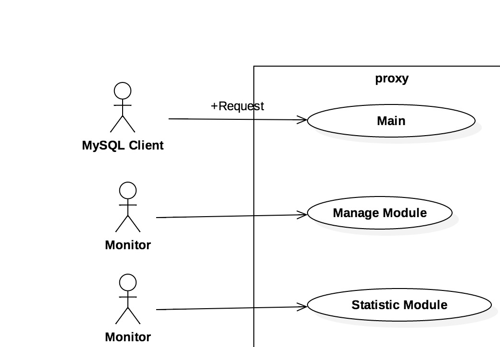

## 1. 背景概述

MySQL服务是一种基于多线程模型的服务，每个客户端连接需要一个对应的线程处理请求。

在互联网的应用场景下，MySQL调用方一般为php-fpm或者uwsgi等采用多进程模型的服务。这种场景下，不论是短连接还是长连接，均会对MySQL服务产生不良影响，影响服务稳定性。

再者，由于上述基于多进程模型的服务，在较高的并发和流量情况下，都会将实例部署到多台物理服务器上面，因此直接暴露MySQL的配置信息，会导致多个物理机器上面的配置需要同时变更，存在运维上面的一些不便。

又有，MySQL本身没有流量控制的功能，在服务因各种内外因素而请求突增的情况下，很容易导致MySQL服务器被压垮，从而引起雪崩效应，影响其他服务。

因此，在Web服务和最终的MySQL服务之间，我们需要有一层抽象中间层，来处理上诉技术问题。抽象中间层、应用服务、MySQL服务三者的层次结构如下：

	 +----------------------+                   +----------------------+
	 |                      |                   |                      |
	 |     PHP-FPM/uwsgi    |                   |     PHP-FPM/uwsgi    |
	 |                      |                   |                      |
	 +----------+-----------+                   +-----------+----------+
	            |                                           |
	            +----------------+          +---------------+
	                             |          |
	                             |          |
	                         +---+----------+---+
	                         |                  |
	                         |  Abstract Layer  |
	                         |                  |
	                         +--------+---------+
	                                  |
	                                  |
	                         +--------+---------+
	                         |                  |
	                         |     MySQL DB     |
	                         |                  |
	                         +------------------+

## 2. 名词解释
SQL指纹： 
	
	针对参数做规约化之后的SQL语句;
	形如 select id, col1, col2 from table where cond1 = ? and cond2 = ?;
	通常由同一组业务服务发出;

## 3. 设计目标

### 3.1 实现的功能

1. MySQL主要协议兼容
2. MySQL服务 High Available & Failover
3. LB（Load Balance） & 资源分配 & 流量控制
4. 内部信息统计
5. 运维管理支持

### 3.2 需求详细描述

#### 3.2.1 MySQL主要协议兼容

* 完全支持 [MySQL Internals](https://dev.mysql.com/doc/internals/en/client-server-protocol.html) 中Chapter 14 中 1-4，6-7中的用户认证，包格式，Text Protocol和Prepare Statement协议
* 完全支持 [SQL Syntax](http://dev.mysql.com/doc/refman/5.6/en/sql-syntax.html) 规范中所有SQL语句，支持大部分CUID操作的SQL指纹识别和聚类
* 支持各语言常用的Client Library，保证客户端库的兼容性

#### 3.2.2 MySQL HA & Failover
* 主库宕机不影响读
* 多从库其一宕机不影响服务
* 主从库平滑切换，平滑上下线
* 数据库故障自动检测

#### 3.2.3 Load Balance & 资源分配 & 流量控制
* 读写分离
* 注释式主读
* IP白名单/黑名单做资源分配
* 基于SQL指纹的动态流量控制

#### 3.2.4 内部信息统计
* 库表级别的QPS统计
* SQL指纹分类统计
* 慢查询统计

#### 3.2.5 运维管理支持
* 管理端口，直接支持SQL语言进行管理

## 4. 系统方案

### 4.1 相关调研

#### 4.1.1 相关开源项目

1. [MySQL Proxy](https://dev.mysql.com/doc/mysql-proxy/en/)
	
	Oracle公司官方出品。目前已经停止维护。没有GA版本，因此不推荐在生产环境中使用。
	
2. [Qihoo360 Atlas](https://github.com/Qihoo360/Atlas)

	基于 MySQL Proxy 0.8.2 版本进行二次开发的Proxy。具备读写分离，连接池，负载均衡，IP白名单等功能
	
3. [SOHU-DBProxy](https://github.com/SOHUDBA/SOHU-DBProxy)

	基于 MySQL Proxy 0.8.3 版本进行二次开发的Proxy。除了具备Atlas同等的基本功能外，还添加了基于配置文件的SQL语句的过滤和审核功能

4. [Youtube Vitess](http://vitess.io/)
	
	Youtube开源的一个MySQL机器集群方案。不兼容MySQL Client-Server Protocol，必须使用官方提供的Client Library
	
5. [MyCAT](https://github.com/MyCATApache/Mycat-Server)

	开源社区维护的，支持分库分表的MySQL中间层代理。但是由于本身是分布式的，有一定事务及跨库查询上面的限制

#### 4.1.2 开源可选方案的功能完备性调研

| 需求           | Atlas   | SOHU-DBProxy  |  Vitess |  MyCAT |
| ------------- |:--:| :-----:|:----:|:---:|
| 协议兼容性       | ✔︎ | ✔︎ | ✖︎ |  ✔︎ |
| Load Balance   | ✔︎ | ✔︎ | ✔︎ |  ✔︎ |
| High Available | ✔︎ | ✔︎ | ✔︎ |  ✔︎ |
| Failover       | ✔︎ | ✔︎ | ✔︎ |  ✔︎ |
| 资源分配        | O | O | ✔︎ | ✖︎ |
| 流量控制        | ✖︎ | O | ✖︎ | ✖︎ |
| 内部信息统计     | ✖︎ | O | ✖︎ | O |
| 运维管理        | O | O | ✔︎ | O |

注：

	✔︎ ： 完全满足需求
	✖︎ ： 完全不满足需求
	O ： 部分满足需求

### 4.2 总体思路

以架构的角度来看，中间层实现可以分为2大类：

	1. 客户端
	   即实现为语言相关的 Library. 在Library内部去提供相关能力。淘宝的TTDL即为这一类
	2. 服务端
	   即以一个独立的服务，提供完备的MySQL Server同等能力的服务

由于客户端的实现是语言相关的，因此我们不考虑以客户端的方式来实现。

### 4.3 技术选型

* 语言： Golang 1.5 +
* 平台： 支持Linux, Mac 10.9+
* 框架： 无

技术选型的理由： 研发技术储备能够cover + 主要研发者语言方面的兴趣

### 4.4 运维及容灾考虑
待补充

## 5. 系统设计

### 5.1 总体架构

总体架构图如[第一节]()所列

系统存在3类使用角色

1. MySQL客户端
		
		这类角色发起MySQL请求，等待请求结果
2. DBA 
		
		DBA通过管理端口来操作系统。
		譬如修改白名单，通过指纹封禁某类SQL，下线故障的后端MySQL实例等
3. 监控系统

		通过管理端口来请求proxy内部的状态和数据
		譬如获取当前QPS，获取某个MySQL集群的实例数和存活性状态

3类角色的用例图如下：

### 5.2 模块拆分

根据分层模型来看，系统从前到后主要分为如下几个模块：

	+--------------------------------+
	|         Network Module         |
	+--------------------------------+
	|         Package Module         |
	+--------------------+-----------+
	|     Auth Module    |           |
	+--------------------+           |
	|          Protocol Layer        |
	+--------------------------------+
	|           Load Balance         |
	+--------------------------------+
	|     Backend Manager Module     |
	+--------------+-----------------+
	|   Failover   | Connection Pool |
	+--------------+-----------------+
	

从功能角色的角度来看，系统功能模块分为3大类：

1. 网络处理
2. MySQL协议处理
3. 管理模块

根据包的处理流程，我们有如下流程图：

从客户端发起请求的角度来看，系统的时序图如下：

### 5.3 容灾及降级方案
待补充

## 6. 详细设计
### 6.1 模块与层次划分

#### 网络模型
多Routine模型，区分管理Routine和工作Routine 2大类。
 
#### MySQL协议交互模块
大部分时候PROXY并不解包，只进行数据的透传。
准入控制时候需要解包以及构造授权包。
管理进程返回PROXY状态构造MySQL结果包。
 
#### 权限与准入模块
PROXY独立的授权用户名和密码。
IP白名单和黑名单。
前端连接数限制。
服务授权限制。
 
#### 配置管理模块
配置文件结构设计。
配置文件的热加载。
 
#### 连接处理模块
后端连接池。
负载均衡策略。
主动屏蔽不可用Server。
连接超时检测处理。
连接失败重连。
 
#### 读写分离模块
SQL解析。
读写分离策略。
 
#### 日志模块
请求的整个链路记录。
支持构建日志平台，开放给RD自己查错。

#### Hooks模块
支持插件式扩展

## 7. 部署及运维设计
### 7.1 服务架构
#### 7.1.1 服务分布
包括新上线服务的机器数量，服务的模块以及模块如何分布在服务器上；对其他服务是否有关联或数据交互

#### 7.1.2 数据流向
说明线上服务的数据流向，即简要说明线上服务模块是如何工作的
		
#### 7.1.3 服务类型
标明服务各模块的类型是cpu消耗型、io消耗型、大容量磁盘空间消耗型
		
#### 7.1.4 资源情况
包括预计流量、数据量、第三方软件使用情况
	
### 7.2 运维设计
#### 7.2.1 服务冗余性
服务各模块的冗余考虑，如果某个模块所在服务器出现问题如何实现冗余来保证服务不受影响

#### 7.2.2 服务可维护性
包括数据损坏后如何修复，减少单点服务，如果无法避免单点尽量减少单点功能，动态数据正确性的检查

#### 7.2.3 服务可扩展性
当服务访问量或数据量达到上限，服务如何继续保持可扩展性

#### 7.2.4 服务监控
服务需要的监控方式及dashboard地址等 

### 7.3 上线及回滚方案
给出上线方案分析，并分析哪些环节可能导致回滚，给出回滚的风险评估，给出如何避免、处理回滚的具体措施

## 8. FAQ
